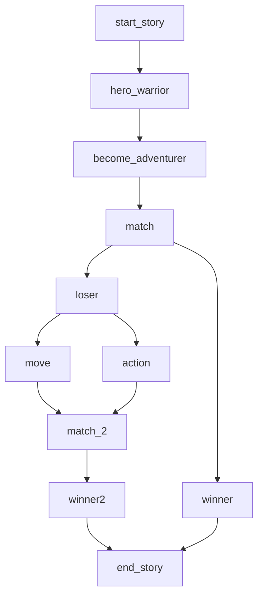

  

## Introducción

Starkane es un emocionante juego RPG por turnos en el que los jugadores lideran un grupo de héroes en un mundo y participan en batallas estratégicas, tomando decisiones tácticas para derrotar a enemigos. Durante la exploración, reclutas y mejora personajes, mientras que en las batallas, el posicionamiento y la selección de acciones son clave para el éxito. ¡Prepárate para vivir una experiencia única donde cada decisión cuenta y el destino de tu equipo está en tus manos!

## Desarrollo Actual

El juego cuenta con un frontend implementado en Unity, mientras que el backend se ha construido con Dojo en Starknet (es un juego con el 100% de su lógica onchain!).
En Unity, disfruta de un mundo libre para explorar, pero cuando la acción comienza, la lógica del combate se traslada completamente a Dojo.
Actualmente, el juego se juega de forma local mediante un instalador, pero la visión es llevarlo a la web. El bot, implementado como un algoritmo en Unity, brinda desafíos incluso en partidas de un solo jugador, y ademas podrias retar a tus amigos a jugar una partida de Starkane.

### Mecánicas del Juego

El juego se desarrolla por turnos, permitiendo a cada jugador realizar dos acciones por héroe en su turno: movilizarse y/o llevar a cabo una acción (ya sea lanzar magia, atacar o usar un objeto). Estas acciones son independientes y se ajustan a la estrategia única de cada jugador.

### Mecánicas Adicionales

* Juega 5 combates y mintea un mapa de C&C.
* Crea vínculos, obten recomendaciones de otros jugadores de Starkane y mintea un heroes exclusivos.

### Heroe

Un heroe posee los siguientes atributos.

1. **HP (puntos de vida):** Representa los puntos de vida que tiene el heroe.

2. **MP (puntos de magia):** Representa la cantidad de puntos de magia que el heroe tiene. Se suelen consumir al usar habilidades mágicas.

3. **Attack (ataque):** La fuerza física del heroe, que afecta la cantidad de daño infligido en ataques normales.

4. **Defense (defensa):** La capacidad del heroe para resistir el daño físico, reduciendo la cantidad de daño recibido.

5. **Evasion (evasión):** La capacidad del heroe para evitar ataques enemigos.

6. **Crit Chance (probabilidad de crítico):** La probabilidad de que los ataques del heroe sean críticos, infligiendo daño adicional.

7. **Crit Rate (multiplicador de crítico):** El factor por el cual se multiplica el daño cuando se realiza un ataque crítico.

8. **Movement Range (rango de movimiento):** Indica cuántas casillas puede moverse el heroe durante su turno en el juego.

### Skill

Cada heroe tiene habilidades que pueden ser ofensivas y defensivas. Tambien tenemos ataques magicos especiales y basicos. Son los siguientes:

1. **MeeleAttack (Ataque cuerpo a cuerpo):** Permite al heroe realizar ataques físicos a corta distancia.

2. **RangeAttack (Ataque a distancia):** Permite al heroe realizar ataques físicos desde una distancia.

3. **Fireball (Bola de fuego):** Permite al heroe lanzar proyectiles de fuego hacia el enemigo. Esta habilidad tiene un alcance mayor que los ataques físicos.

4. **Heal (Curar):** Representa habilidades de curación que permiten al heroe restaurar los puntos de vida (HP) de sí mismo o de otros personajes en el juego.

5. **SpecialMeeleAttack (Ataque cuerpo a cuerpo especial):** Este ataque puede diferenciarse de los ataques cuerpo a cuerpo estándar por su naturaleza única o poderosa.

6. **SpecialRangeAttack (Ataque a distancia especial):** Este ataque tiene propiedades únicas que lo distinguen de los ataques a distancia convencionales.

### Mapa

Los mapas son grillas 2D de tamaño N*M, donde tenemos casillas caminables y no caminables.
El mapa esta construido en Dojo con la lib C&C y se renderiza en unity de forma dinamica.
Actualmente, contamos con un único mapa de 25 x 25.

### Game Loop

### Libs Utilizadas

* [C&C](https://github.com/CheDAOLabs/cryptsandcaverns): Para la construcción del mapa.
* [Dojo.Unity](https://github.com/dojoengine/dojo.unity): Para conectar Dojo con Unity.
* [Alexandria](https://github.com/keep-starknet-strange/alexandria): Utilizamos los algoritmos de ordenamiento para el ranking.

## Futuro del Juego

* Agregar modo multijugador para enfrentamientos más desafiantes.
* Implementar una inteligencia artificial mejorada utilizando Orion (ejemplo: tic-tac-toe).
* Agregar mas personajes y habilidades
* Construir un mundo abierto donde puedas realizar quest y obtener recompensas
* Subir de niveles y aprender nuevas habilidades
* Tener un hilo argumental para mejorar la esencia del juego
* Agregar actualizaciones con nuevos personajes y skills

## Special thanks

## Supporters
Unete como Supporters

### Creators ✨
Thanks goes to these wonderful people
([emoji key](https://allcontributors.org/docs/en/emoji-key)):

<table>
  <tbody>
    <tr>
    <td align="center" valign="top" width="14.28%"><a href="https://github.com/dubzn"> <b>dubzn</b></a> 😸</a></td>
      <td align="center" valign="top" width="14.28%"><a href="https://github.com/dpinones"> <b>Damián Piñones</b></a> 🤠</a></td>
      <td align="center" valign="top" width="14.28%"><a href="https://github.com/cristianFleita"> <b>Cristian Fleita</b></a> 💻</a></td>
      <td align="center" valign="top" width="14.28%"><a href="https://github.com/aikomisa5"> <b>Misael Britos</b></a> 🐦</a></td>
      <td align="center" valign="top" width="14.28%"><a href="https://github.com/brendaamareco"> <b>Brenda Mareco</b></a> 🎨</a></td>
    </tr>
</tbody>
</table>

### Dojo Sensei ⛩️
Thanks goes to these wonderful people
([emoji key](https://allcontributors.org/docs/en/emoji-key)):

<table>
  <tbody>
    <tr>
      <td align="center" valign="top" width="14.28%"><a href="https://github.com/Larkooo"> <b>Larkooo</b></a> 🚬</a></td>
      <td align="center" valign="top" width="14.28%"><a href="https://github.com/ponderingdemocritus"> <b>Loaf</b></a> 🍞</a></td>
    </tr>
</tbody>
</table>
