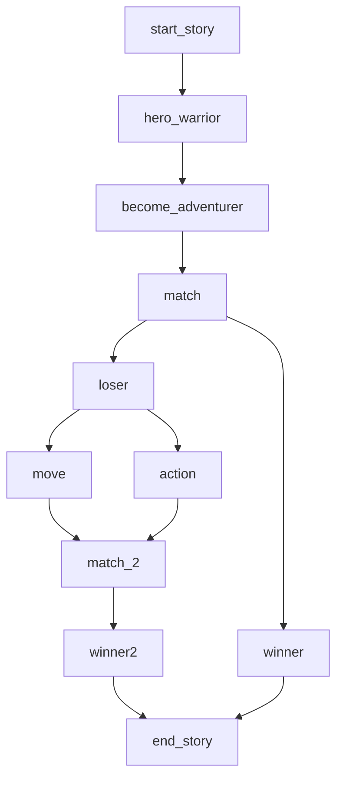

  

# Introduction

Starkane is an exciting turn-based RPG game where players lead a group of heroes in a world, engaging in strategic battles, making tactical decisions to defeat enemies. During exploration, recruit and upgrade characters, while in battles, positioning and action selection are crucial for success. Get ready to experience a unique journey where every decision counts, and the fate of your team is in your hands!

## Game Links

- **Website:** [Starkane](https://starkane.xyz/)
- **Trailer:** [Watch Trailer](https://www.youtube.com/watch?v=hy_h6x8kFAU)
- **Gameplay:** [Watch Gameplay](https://www.youtube.com/watch?v=OBTVBRo8JSc)
- **itch.io:** [Starkane on itch.io](https://dubzn.itch.io/starkane)
- **Frontend:** [Repository Starkane Unity](https://github.com/amegakure-starknet/starkane-unity)

## Current Development

The game features a frontend implemented in Unity, while the backend is built with Dojo on Starknet (it's a game with 100% on-chain logic!). In Unity, enjoy a freely explorable world, but when the action begins, the combat logic shifts entirely to Dojo. Currently, the game is played locally through an executable, but the vision is to take it to the web. The bot is implemented as an algorithm in Unity, providing challenges even in single-player matches, and you can also challenge your friends to a Starkane match.

### Limitations

Starkane has some limitations that are important to note:

- **Web Usage Restriction:** Currently, it's not possible to use the web version due to the lack of support in the dojo.unity library for WEBGL.

- **Slot Implementation Missing:** Currently, we don't proceed with the implementation of Starkane in Slot due to an error in the dojo.unity library when establishing a connection with Torii.

### Used Libraries

The development of Starkane has benefited from several open-source libraries, including:

- [C&C](https://github.com/CheDAOLabs/cryptsandcaverns): Used for map construction.
- [Dojo.Unity](https://github.com/dojoengine/dojo.unity): Used to facilitate the connection between Dojo and Unity.
- [Alexandria](https://github.com/keep-starknet-strange/alexandria): We use the sorting algorithms provided by this library to implement the ranking system.

## How to Play?

For detailed instructions on how to set up the environment and start playing Starkane locally, check the [development readme](./development.md). Follow the steps provided to enjoy the gaming experience. Have fun!

## Mechanics

Starkane is characterized by a turn-based gameplay system that gives each player the opportunity to perform two actions per hero during their turn. These actions include mobilization and the execution of an action, which can be casting magic, attacking, or using an item. Each action is independent and adapts to the unique strategy of each player.

### Additional Features

In addition to the main mechanics, we have various additional features to enhance the gaming experience:

- **Combats and C&C Maps Minting:** Engage in 5 battles and mint a Crypts & Caverns (C&C) map.

- **Link Creation and Recommendations:** Create links, get recommendations from other Starkane players, and mint an exclusive hero.

- **Ranking System:** It features a ranking system that ranks players based on their performance in the game.

- **Random Factors in Attacks:** During the execution of attack actions, keep in mind that there is a random factor, meaning attacks can vary in intensity, either weaker or stronger. This adds an element of surprise and strategy to the game.

### Models

#### Hero

A hero has the following attributes.

1. **HP (Hit Points):** Represents the hero's life points.

2. **MP (Magic Points):** Represents the amount of magic points the hero has. Usually consumed when using magic skills.

3. **Attack:** The hero's physical strength, affecting the amount of damage dealt in normal attacks.

4. **Defense:** The hero's ability to resist physical damage, reducing the amount of damage received.

5. **Evasion:** The hero's ability to avoid enemy attacks.

6. **Crit Chance:** The probability of the hero's attacks being critical, inflicting additional damage.

7. **Crit Rate:** The factor by which damage is multiplied when a critical attack is performed.

8. **Movement Range:** Indicates how many squares the hero can move during their turn in the game.

#### Skill

Each hero has skills that can be offensive and defensive. We also have special and basic magical attacks. They are as follows:

1. **MeeleAttack (Melee Attack):** Allows the hero to perform physical attacks at close range.

2. **RangeAttack (Ranged Attack):** Allows the hero to perform physical attacks from a distance.

3. **Fireball:** Allows the hero to launch fire projectiles at the enemy. This skill has a greater range than physical attacks.

4. **Heal:** Represents healing skills that allow the hero to restore life points (HP) to themselves or other characters in the game.

5. **SpecialMeeleAttack (Special Melee Attack):** This attack can differ from standard melee attacks due to its unique or powerful nature.

6. **SpecialRangeAttack (Special Ranged Attack):** This attack has unique properties that distinguish it from conventional ranged attacks.

#### Map

Maps are 2D grids of size N*M, where we have walkable and non-walkable tiles. The map is built in Dojo with the C&C library and rendered in Unity dynamically. Currently, we have a single map of size 25 x 25.

### Game Loop

# Future of the Game

The ongoing development of Starkane will include exciting features to enrich the gaming experience:

- **Multiplayer Mode:** Support multiplayer mode for more challenging matchups.

- **Improved Artificial Intelligence:** Utilize ML Bot technology as seen in the classic game [tic-tac-toe](https://github.com/OwnerOfJK/TicTacToeAgent).

- **Open World and Quests:** An open world within Starkane, where players can embark on exciting quests to earn rewards and immerse themselves further in the game's narrative.

- **Level and Skill Progression:** The ability to level up and learn new skills.

- **Narrative Plot:** Create a storyline to enhance the essence of the game.

- **Continuous Updates:** Have periodic updates that will include new characters and skills, ensuring the gaming experience is always fresh and exciting.

# Supporters

Join us as Supporters and be an active part of Starkane's growth and continuous development. Your support is essential to take the game to new heights. Join [here](pinonesdamian@gmail.com) and be part of this exciting adventure!

### Creators ✨
Thanks goes to these wonderful people
([emoji key](https://allcontributors.org/docs/en/emoji-key)):

<table>
  <tbody>
    <tr>
    <td align="center" valign="top" width="14.28%"><a href="https://github.com/dubzn"> <b>dubzn</b></a> 😸</a></td>
      <td align="center" valign="top" width="14.28%"><a href="https://github.com/dpinones"> <b>Damián Piñones</b></a> 🤠</a></td>
      <td align="center" valign="top" width="14.28%"><a href="https://github.com/cristianFleita"> <b>Cristian Fleita</b></a> 💻</a></td>
      <td align="center" valign="top" width="14.28%"><a href="https://github.com/aikomisa5"> <b>Misael Britos</b></a> 🐦</a></td>
      <td align="center" valign="top" width="14.28%"><a href="https://github.com/brendaamareco"> <b>Brenda Mareco</b></a> 🎨</a></td>
    </tr>
</tbody>
</table>

### Dojo Sensei ⛩️
Thanks goes to these wonderful people
([emoji key](https://allcontributors.org/docs/en/emoji-key)):

<table>
  <tbody>
    <tr>
      <td align="center" valign="top" width="14.28%"><a href="https://github.com/Larkooo"> <b>Larkooo</b></a> 🚬</a></td>
      <td align="center" valign="top" width="14.28%"><a href="https://github.com/ponderingdemocritus"> <b>Loaf</b></a> 🍞</a></td>
    </tr>
</tbody>
</table>